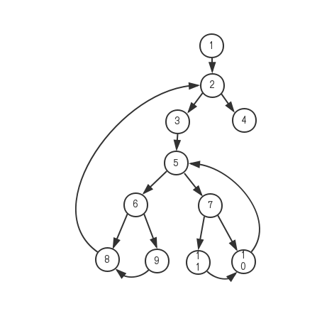
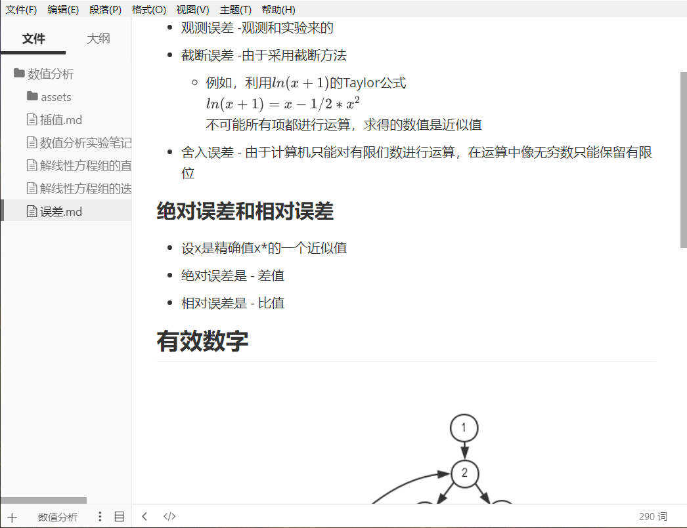

## 误差的来源和分类

### 按来源来分类

- 模型误差 -在抽象时的误差
- 观测误差 -观测和实验来的
- 截断误差 -由于采用截断方法
  - 例如，利用$ln(x+1)$的Taylor公式
    $ ln(x+1) =x-1/2*x^2$
    不可能所有项都进行运算，求得的数值是近似值
- 舍入误差 - 由于计算机只能对有限们数进行运算，在运算中像无穷数只能保留有限位

### 绝对误差和相对误差

- 设x是精确值x*的一个近似值
- 绝对误差是 - 差值
- 相对误差是 - 比值

## 有效数字                                                                                                                                                                                                                                                                                                                                                                                                                                                                                                                                                                                                                                                                                                                                                                                                                                                                                                                                                                                                                                                                                                                                                                                                                                                                                                                                                                                                 

## 数值计算中的若干原则

- 避免两个相近的数想减
  - 差的相对误差会被放大
  - 举例
- 防止大数“吃掉”小数
  - 计算机中浮点数有效位要学习
- 绝对值太小的数不宜作除数
  - 由于除数很小，误差会被放大
- 注意简化计算程序，减少计算次数
  - 计算次数太多，
- 选用数值稳定性好的算法
  - 